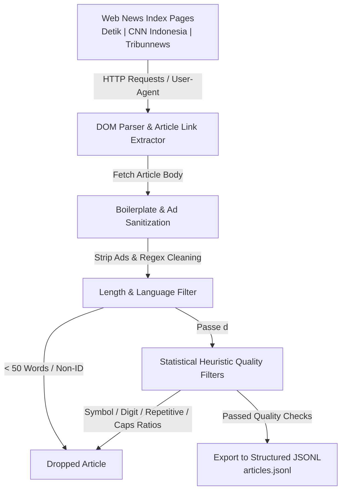

# Indonesian Text Corpus Pipeline for LLM Pretraining

A high-performance data collection, cleaning, and heuristic quality filtering pipeline designed to build a clean **Indonesian-language pretraining text corpus** from real-world web news sources (*Detik.com*, *CNN Indonesia*, and *Tribunnews*).

This project simulates the data engineering and quality validation workflows used by LLM data teams to transform noisy raw web data into high-quality training datasets for Large Language Models.

---

## 📌 Project Overview

Raw web text cannot be fed directly into an LLM for pretraining due to boilerplate noise (advertisements, navigation links, scroll prompts), low-quality text dumps, near-duplicate articles, and non-target languages.

This repository implements an automated, multi-stage pipeline that collects, cleans, and statistically filters raw Indonesian news articles across 5 major categories: **Nasional, Internasional, Ekonomi, Teknologi,** and **Olahraga**.

---

## ⚙️ Pipeline Architecture



### 🛠️ Key Pipeline Stages

#### 1. Data Collection & Extraction (Stage 1)
- **Multi-Source Scraping**: Pulls index news pages from Detik, CNN Indonesia, and Tribunnews.
- **Custom DOM Parsing**: Tailored extraction logic handling site-specific HTML structures (`<article>` elements on Detik/CNN, `<ul class="lsi">` / `<li class="ptb15">` on Tribunnews).
- **Standardized Date Parsing**: Converts multi-format Indonesian date strings (e.g. `"Kamis, 10 September 2026 17:51 WIB"`, `"x jam yang lalu"`) into normalized ISO `datetime` objects.

#### 2. Boilerplate & Noise Sanitization
- **String Cleaning**: Removes inline ad blocks, UI prompts (`ADVERTISEMENT`, `SCROLL TO RESUME CONTENT`, `Baca juga:`).
- **Regex Tag Stripping**: Strips dynamic media embed tags using pattern matching:
  ```python
  re.sub(r"\[Gambas.*?\]", "", content)
  ```

#### 3. Language & Length Filtering (Stage 2)
- **Length Thresholding**: Automatically drops stubs, teaser previews, and image captions with `< 50 words`.
- **Language Identification**: Uses `langdetect` to enforce strict Indonesian (`id`) language requirements and filter out foreign text.

#### 4. Statistical Heuristic Quality Filtering (Stage 3)
Implemented via document-level statistical rules to drop low-quality articles:

| Filter Function | Method / Rule | Purpose |
| :--- | :--- | :--- |
| **`symbol_to_word_ratio`** | Checks ratio of special symbols (`@#$%^&*~\|\{}\[\]`) to total words (`> 0.2`) | Drops corrupted HTML/JS dumps while preserving standard punctuation. |
| **`digit_to_word_ratio`** | Checks ratio of distinct number tokens (`\b\d+\b`) to words (`> 0.3`) | Drops raw financial tables, stock tickers, and score sheets. |
| **`repetitive_text_ratio`** | Checks ratio of repeated 8-grams to unique 8-grams (`> 0.3`) | Detects and drops web-crawler duplicate loops and repeated site footers. |
| **`all_caps_ratio`** | Checks ratio of uppercase words to total words (`> 0.5`) | Drops clickbait shouting, SPAM, and header lists. |

---

## 📂 Data Schema (`articles.jsonl`)

Output records are appended line-by-line in JSON Lines (`JSONL`) format:

```json
{
  "Link": "https://www.tribunnews.com/nasional/...",
  "Source": "www.tribunnews.com",
  "Kategori": "nasional",
  "Title": "Dudung Tegaskan Ulta Levenia Nababan Bukan Lagi Bagian KSP",
  "Tanggal": "2026-09-10 17:51",
  "Isi Berita": "TRIBUNNEWS.COM, JAKARTA - Kepala Staf Kepresidenan..."
}
```

---

## 🚀 Getting Started

### Prerequisites
- Python 3.10 or higher
- Virtual environment (`venv`)

### Installation

1. **Clone the Repository**:
   ```bash
   git clone https://github.com/your-username/id-llm.git
   cd id-llm
   ```

2. **Set up Virtual Environment**:
   ```bash
   python -m venv venv
   # On Windows (PowerShell):
   .\venv\Scripts\Activate.ps1
   # On Linux/macOS:
   source venv/bin/activate
   ```

3. **Install Dependencies**:
   ```bash
   pip install requests beautifulsoup4 tqdm langdetect lxml
   ```

### Running the Pipeline

Execute the main pipeline script:
```bash
python app.py
```

Progress logs and filtered article counts will display in real time via `tqdm`:
```text
--- Scraping Kategori: nasional ---
Scraping page 1 | url https://www.tribunnews.com/index-news/nasional?page=1
Filtered out article with too many digits: Grafik Pergerakan Saham Sektor
Success [nasional]: Dudung Tegaskan Ulta Levenia Nababan Bukan Lagi
[nasional] Halaman 1: 100%|████████████████████████| 20/20 [00:15<00:00]

Finished scraping! Saved total articles to articles.jsonl
```

---

## 🛠️ Tech Stack

- **Language:** Python 3
- **Web Crawling:** `requests`, `BeautifulSoup4`, `lxml`
- **Progress & CLI:** `tqdm`
- **Language Detection:** `langdetect`
- **Text Processing & Regex:** `re`, `urllib.parse`
- **Storage Format:** JSONL (JSON Lines)

---

## 🗺️ Project Roadmap

- [x] **Stage 1**: Multi-source web crawling & DOM extraction (Detik, CNN, Tribun).
- [x] **Stage 2**: Language detection (`langdetect`) & length filtering.
- [x] **Stage 3**: Statistical heuristic quality filtering (symbol, digit, n-gram repetition, all-caps).
- [ ] **Stage 4**: Perplexity-based text quality scoring using a pretrained language model (`transformers` / IndoBERT).
- [ ] **Stage 5**: MinHash / LSH Near-Duplicate Detection (`datasketch`).
- [ ] **Stage 6**: PII Detection & Redaction (Regex for phone numbers, email addresses, NIK/IDs).
- [ ] **Stage 7–9**: Quality annotation sampling, intra-rater consistency analysis, and final report.
